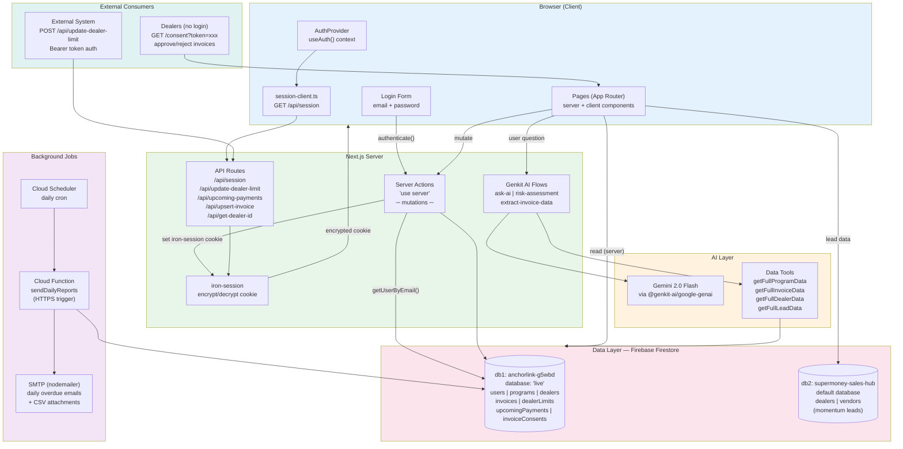

# Architecture Diagram

> **Auto-generated**. Last updated: 2026-05-07.
> When making architecture-level changes (new services, data stores, auth flows, external integrations, new Cloud Functions), update this diagram.



## Component Map

| Layer | Key Files | Purpose |
|-------|-----------|---------|
| Auth | `src/app/auth/actions.ts`, `src/lib/session.ts`, `src/lib/session-client.ts`, `src/context/auth-context.tsx` | Iron-session cookie auth, client-side session check |
| Data | `src/lib/data.ts`, `src/lib/firebase.ts` | Two-Firestore data access, all reads/writes |
| AI | `src/ai/genkit.ts`, `src/ai/flows/*.ts`, `src/ai/tools/data-tools.ts` | Genkit + Gemini flows |
| UI Layout | `src/app/layout.tsx`, `src/components/nav.tsx` | AuthProvider + role-based sidebar |
| Background | `src/functions/index.ts` | Cloud Function for daily reports |
| External API | `src/app/api/*/route.ts` | REST endpoints for external systems |

## Key Flows

### Invoice Lifecycle
```
Initiated → Approved → Sent to Lender → Consent Approved → Disbursed
                 ↘ Rejected (any point)
```

### Dealer Onboarding Pipeline
```
Lead Created → Lead Verified → Documents Collected → Documents Verified
    → Site Visit Done → Business Limit Approved → Dealer Activated
```

### Role Hierarchy
```
Admin ─── full access, user management
SuperMoney User ─── Admin minus user management
Anchor ─── scoped to their externalId
  ├─ sales_person       → add leads
  ├─ sales_manager      → validate leads
  ├─ onboarding_ops     → verify documents
  ├─ field_inspector    → site visit reports
  ├─ legal_compliance   → document + site verification
  ├─ regional_manager   → credit check + limit approval
  └─ dealer_admin       → final activation
```
